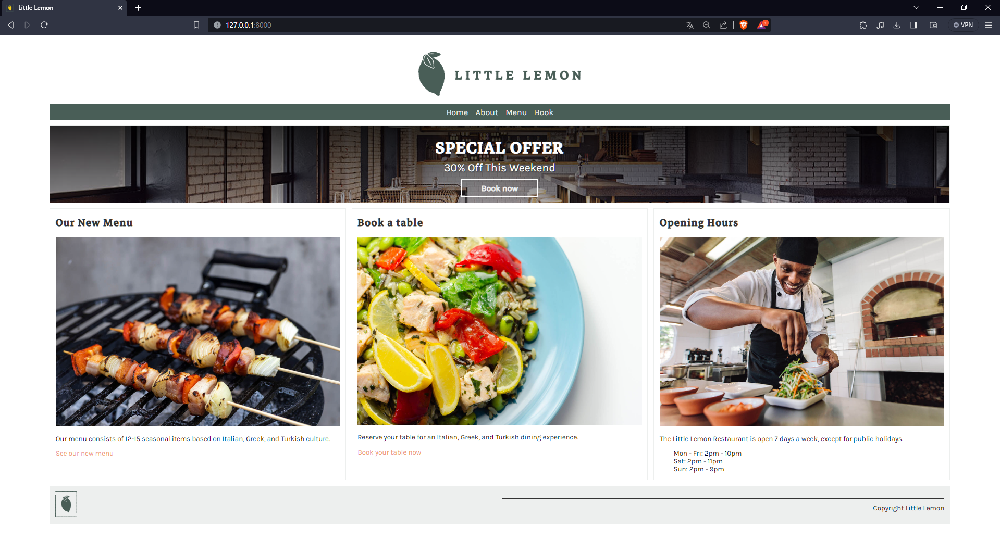
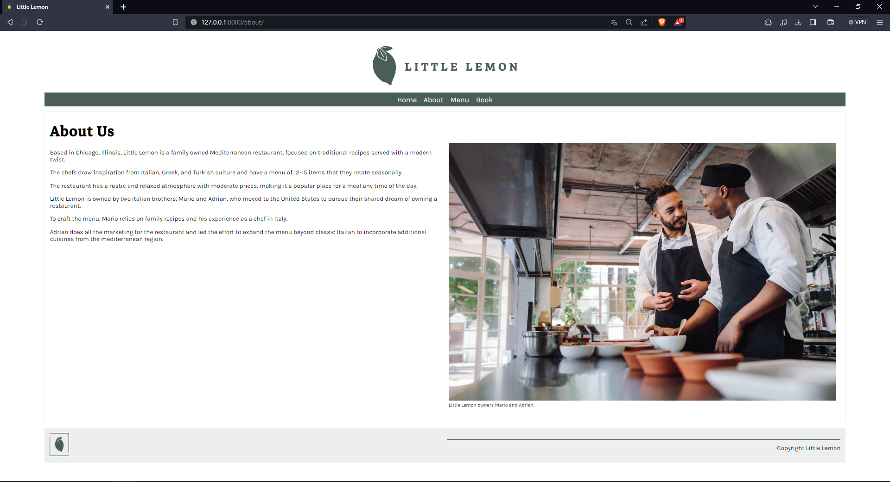
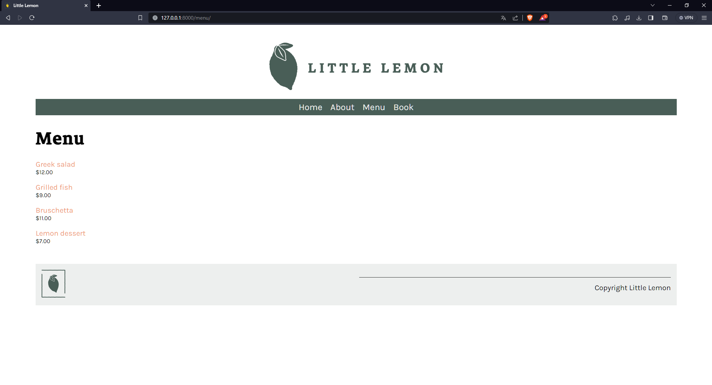
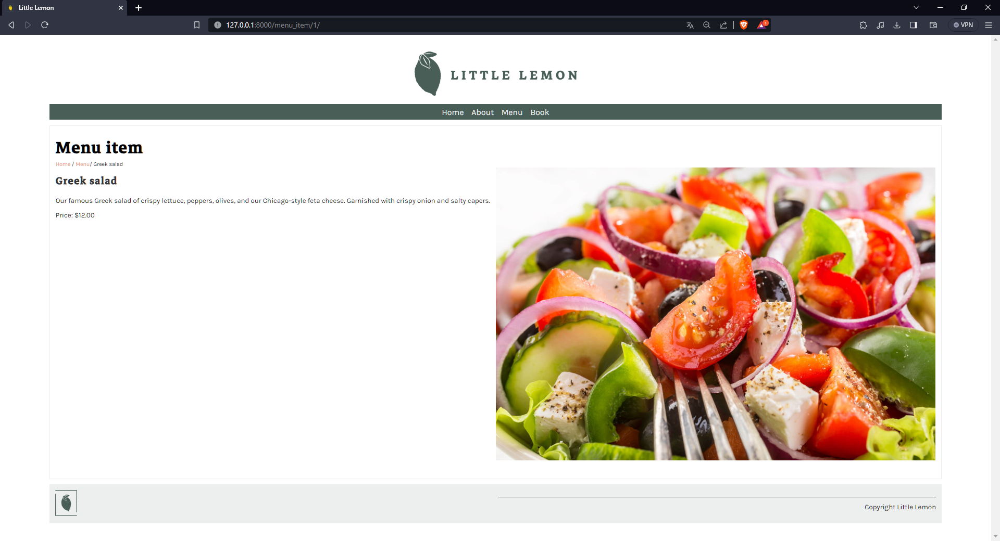
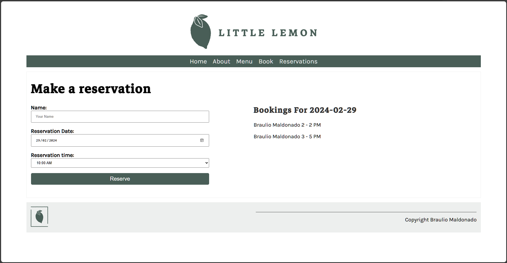
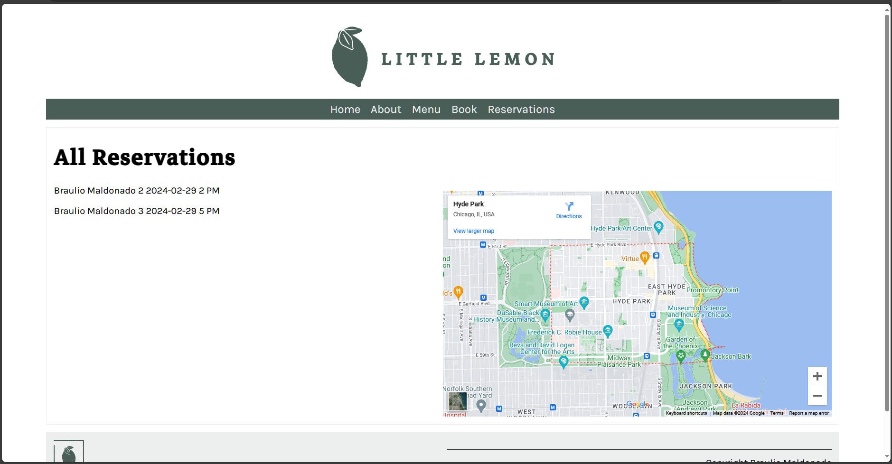

# The Full Stack App

@ShinjiMC - By Braulio Nayap Maldonado Casilla

## Description of the Project

In this segment of the "Little Lemon" restaurant web project, we concentrate on the Book and Booking functionalities, targeting both user interface and backend operations. This initiative is part of a broader interactive platform designed to meet the diverse needs of a restaurant business. While the complete project spans various aspects, including Home, About, and Menu views, our focus here is squarely on enhancing the reservation process. Utilizing Django's robust framework and SQLite3 for database management, we aim to streamline the booking experience. This approach ensures a user-friendly interface for patrons to effortlessly make reservations, complemented by a backend system that efficiently manages these bookings. By honing in on these functionalities, we endeavor to provide a seamless interaction point for customers, emphasizing convenience and efficiency in the reservation process within the digital ecosystem of the "Little Lemon" restaurant.

## Running the Project

### Set up a Virtual Environment

To begin, install `virtualenv` if you haven't already:

```bash
pip install virtualenv
```

Create a new virtual environment:

```bash
python -m venv myenv
```

For Windows:

```bash
./myenv/Scripts/Activate.ps1
```

For Linux:

```bash
source myenv/Scripts/activate
```

### Install Django in the Virtual Environment

Once the virtual environment is activated, install Django:

```bash
pip install django
```

### Running the Project

To run the project, execute:

```bash
python manage.py runserver
```

### Exiting the Virtual Environment

To exit the virtual environment when you're done working on the project:

```bash
deactivate
```

## Structure of the Project

### Home View

The Home view acts as the primary interface, presenting crucial information such as the restaurant's operating hours, menu availability, and a convenient section for making reservations. This section serves as the gateway for visitors, offering a glimpse into the restaurant's offerings and encouraging them to explore further.


### About View

In the About view, patrons can delve deeper into the restaurant's narrative. This section encapsulates the restaurant's history, core values, and additional details that define its uniqueness. It provides a comprehensive overview, allowing visitors to connect with the establishment on a more personal level.


### Menu View

The Menu view showcases the culinary delights available at the Little Lemon restaurant. It displays an assortment of dishes alongside their respective prices, inviting customers to explore the diverse range of flavors and options offered by the establishment.


### Menu Item View

For a more detailed insight into specific dishes, the Menu Item view provides in-depth information about individual menu items. Visitors can access detailed descriptions, images, and additional specifics about each dish, aiding them in making informed dining choices.


### Book View

The Book view is ingeniously designed to simplify the reservation process for patrons of the restaurant. This user-friendly interface is split into two main sections: on the left side, users are presented with a straightforward reservation form where they can enter their details, such as name and preferences, and select a reservation slot. On the right side, the view dynamically displays the reservations already made for the chosen date, allowing users to see available times at a glance. This design not only enhances user experience by making booking effortless but also provides immediate feedback on the day's booking status.


### Reservations View

The Reservations view offers a comprehensive snapshot of all bookings made for the current day, presenting a detailed list on the left side of the screen. This list includes essential information such as the names of the guests, their reservation times, and any specific preferences or notes related to their visit. On the right side of the view, a Google Maps integration visually pinpoints the restaurant's location, adding a spatial context to the reservations. This view is particularly useful for the restaurant's staff, as it helps in managing the day's reservations efficiently and preparing for the guests' arrival.


## Licencia:

Este proyecto está licenciado bajo [Creative Commons Atribución-NoComercial-CompartirIgual 4.0 Internacional](http://creativecommons.org/licenses/by-nc-sa/4.0/):

<a rel="license" href="http://creativecommons.org/licenses/by-nc-sa/4.0/">
  
</a>
